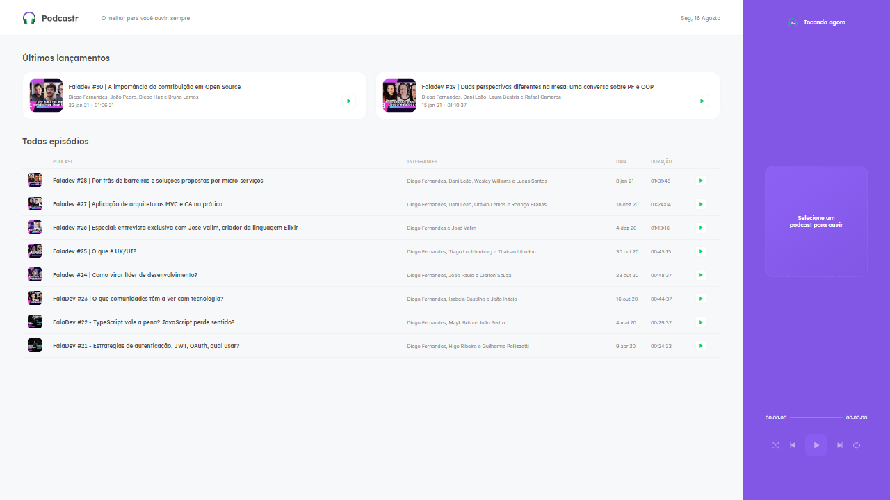

 

## Preview :framed_picture:

## Technologies :microscope:

## License 📝

This project is licensed under the MIT License. See the [LICENSE](https://github.com/josepholiveira/podcastr/blob/main/LICENSE "LICENSE") file for details.

 

**
Made by Paulo Eduardo Jr. with ​💜 Enjoy it!
**
